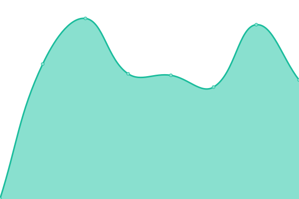

# [📈 Live Status](https://db.jubla.ch): <!--live status--> **🟩 All systems operational**

This repository contains the open-source uptime monitor and status page for [richardjubla](https://www.jubla.ch/datenbank), powered by [Upptime](https://github.com/upptime/upptime).

With [Upptime](https://upptime.js.org), you can get your own unlimited and free uptime monitor and status page, powered entirely by a GitHub repository. We use [Issues](https://github.com/richardjubla/status-jubladb/issues) as incident reports, [Actions](https://github.com/richardjubla/status-jubladb/actions) as uptime monitors, and [Pages](https://db.jubla.ch) for the status page.

<!--start: status pages-->
<!-- This summary is generated by Upptime (https://github.com/upptime/upptime) -->
<!-- Do not edit this manually, your changes will be overwritten -->
<!-- prettier-ignore -->
| URL | Status | History | Response Time | Uptime |
| --- | ------ | ------- | ------------- | ------ |
|  [Datenbank der Jungwacht Blauring Schweiz](https://db.jubla.ch) | 🟩 Up | [datenbank-der-jungwacht-blauring-schweiz.yml](https://github.com/richardjubla/status-jubladb/commits/HEAD/history/datenbank-der-jungwacht-blauring-schweiz.yml) | 

 1144ms
     
 | 

<a href="https://richardjubla.github.io/status-jubladb/history/datenbank-der-jungwacht-blauring-schweiz">100.00%</a>
    

|  [Stage und Test Datenbank](https://jubla.puzzle.ch) | 🟩 Up | [stage-und-test-datenbank.yml](https://github.com/richardjubla/status-jubladb/commits/HEAD/history/stage-und-test-datenbank.yml) | 

 916ms
     
 | 

<a href="https://richardjubla.github.io/status-jubladb/history/stage-und-test-datenbank">100.00%</a>
    

<!--end: status pages-->

[**Visit our status website →**](https://db.jubla.ch)

## 📄 License

- Powered by: [Upptime](https://github.com/upptime/upptime)
- Code: [MIT](./LICENSE) © [Anand Chowdhary](https://anandchowdhary.com), supported by [Pabio](https://pabio.com)
- Data in the `./history` directory: [Open Database License](https://opendatacommons.org/licenses/odbl/1-0/)
